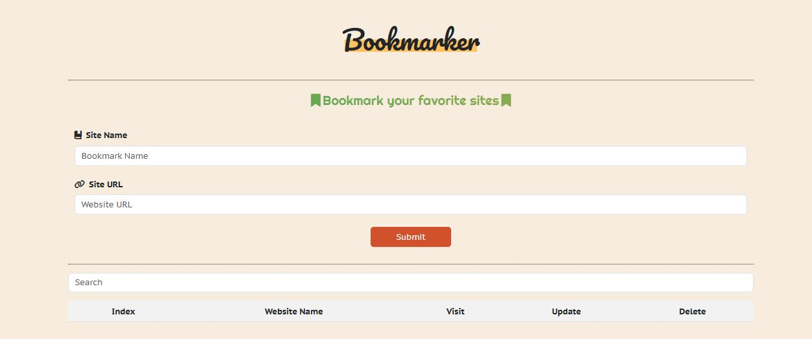

# ⭐ Bookmark CRUD System for Websites


## 🔍 Overview

This project is a web-based CRUD (Create, Read, Update, Delete) system for managing website bookmarks. It allows users to add, view, update, delete, and search for bookmarks easily. The application is built using modern JavaScript (ES6), HTML5, CSS3, and Bootstrap for a responsive and user-friendly interface. All bookmark data is stored locally using the browser's localStorage.

## ✨ Features

- **Add Bookmarks:**  
  Users can add new bookmarks by entering the bookmark name, website URL, and optionally an image for the site.
  
- **Display Bookmarks:**  
  All saved bookmarks are displayed in a dynamic table or card layout. Each bookmark includes its name, website URL, and a thumbnail image.
  
- **Update Bookmarks:**  
  Existing bookmarks can be edited and updated with new information.
  
- **Delete Bookmarks:**  
  Users can easily remove bookmarks from the system.
  
- **Search Bookmarks:**  
  A search functionality allows users to quickly filter through bookmarks based on the bookmark name or URL.
  
- **Real-Time Validation:**  
  Input validation is provided in real-time using JavaScript and Bootstrap classes.
  
- **Responsive Design:**  
  The UI is built with Bootstrap to ensure compatibility across different devices and screen sizes.
  
- **Icons & Visuals:**  
  The interface uses Font Awesome icons to enhance user interaction and visual appeal.

## 🛠️ Technologies Used

- **HTML5 & CSS3:** For structure and styling.
- **JavaScript (ES6):** For implementing CRUD operations, search functionality, and real-time validation.
- **Bootstrap 4:** For responsive design and UI components.
- **Font Awesome:** For using icons to improve the UI.
- **localStorage:** For storing bookmark data locally in the browser.

1. **Clone the Repository:**

   ```bash
   git clone https://github.com/your-username/bookmark-crud-system.git
   cd bookmark-crud-system
